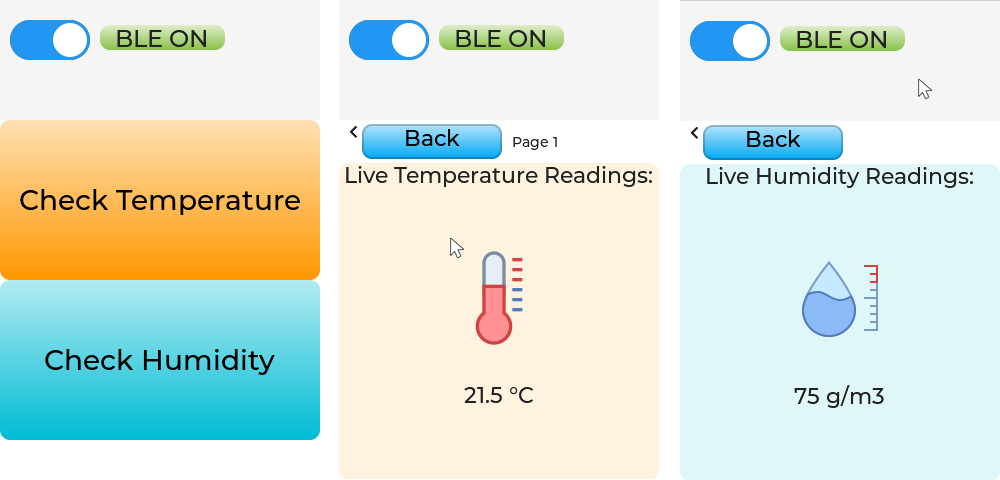

# Bluetooth Low Energy Weather Station

This is a two part project for a basic weather station running on two `ESP32` boards, a `DHT11` temperature and humidity sensor and a `ILI9341` TFT display. The main goal of this project is to read and advertise the sensor data using the ESP32 on the server side and display the data on the display side. Both ESP32s use the NimBLE stack, with the display side acting as the central and the server side as the peripheral.

I created this project mainly to learn about BLE and become comfortable using the NimBLE stack on the ESP-IDF framework.

Links to each side of the Weather Station:

* Server side: https://github.com/32-bit-bender/ble-ws-server-side
* Display side: https://github.com/32-bit-bender/ble-ws-display-side

### Display Side

The display side uses a very simple BLE profile:

* It's a central BLE profile based on the Nimble Stack. The code is mostly inspired by this example: https://github.com/espressif/esp-idf/tree/master/examples/bluetooth/nimble/blecent

* The central device creates a GATT client that performs passive scans and connects to a peripheral device that matches the custom UUID chosen on the server side.

* After connecting to the peer server, the client performs periodic reads on the read service provided by the server.

* The display is based on the LVGL library: https://docs.lvgl.io/master/details/integration/chip/espressif.html

* It's a custom menu built to take advantage of the touch screen capability of the TFT display.

* The data read is displayed periodically in the LVGL menu, and can be accessed using the touch screen and choosing between the temperature or humidity page.

* The menu UI also gives the option to turn on and off the BLE if desired.

* The display controller is also based on an example: https://github.com/espressif/esp-idf/tree/master/examples/peripherals/spi_master/lcd

### Hardware Connection
* Pin Connections:

```
       ESP Board                       GC9A01/ILI9341 Panel + TOUCH
┌──────────────────────┐              ┌────────────────────┐
│             GND      ├─────────────►│ GND                │
│                      │              │                    │
│             3V3      ├─────────────►│ VCC                │
│                      │              │                    │
│             PCLK     ├─────────────►│ SCL                │
│                      │              │                    │
│             MOSI     ├─────────────►│ MOSI               │
│                      │              │                    │
│             MISO     |◄─────────────┤ MISO               │
│                      │              │                    │
│             RST      ├─────────────►│ RES                │
│                      │              │                    │
│             DC       ├─────────────►│ DC                 │
│                      │              │                    │
│             LCD CS   ├─────────────►│ LCD CS             │
│                      │              │                    │
│             TOUCH CS ├─────────────►│ TOUCH CS           │
│                      │              │                    │
│             BK_LIGHT ├─────────────►│ BLK                │
└──────────────────────┘              └────────────────────┘
```
* __Setup__:


* __Menu Pages__:



### Build, Flash, and Monitor

* Prerequisites: You must have ESP-IDF installed on your machine. If that's not the case, follow the official guide [for linux](https://docs.espressif.com/projects/esp-idf/en/stable/esp32/get-started/linux-macos-setup.html) or [for windows](https://docs.espressif.com/projects/esp-idf/en/stable/esp32/get-started/windows-setup.html).

* Clone the project
* Build using `idf.py build`
* Flash using `idf.py flash -p <PORT>` with PORT being the USB port connected to your ESP board (for example, `idf.py flash -p /dev/ttyUSB0`)
* To see the ESP32's serial monitor, you can run `idf.py monitor -p <PORT>` (To exit the serial monitor, type ``Ctrl-]``)

